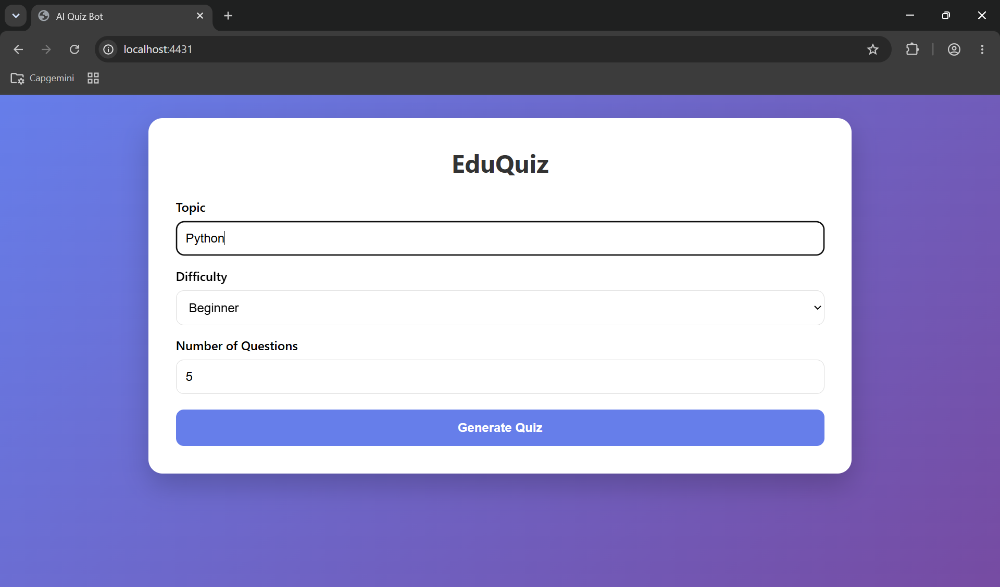
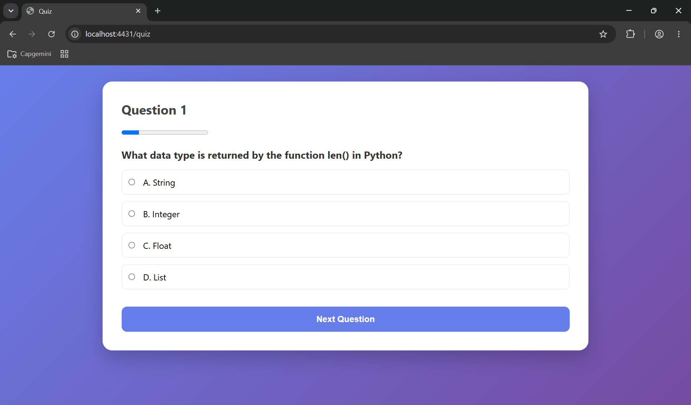
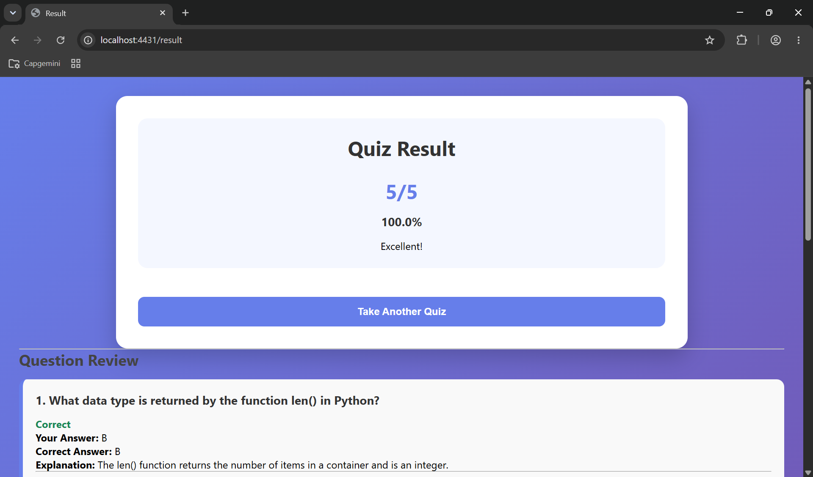
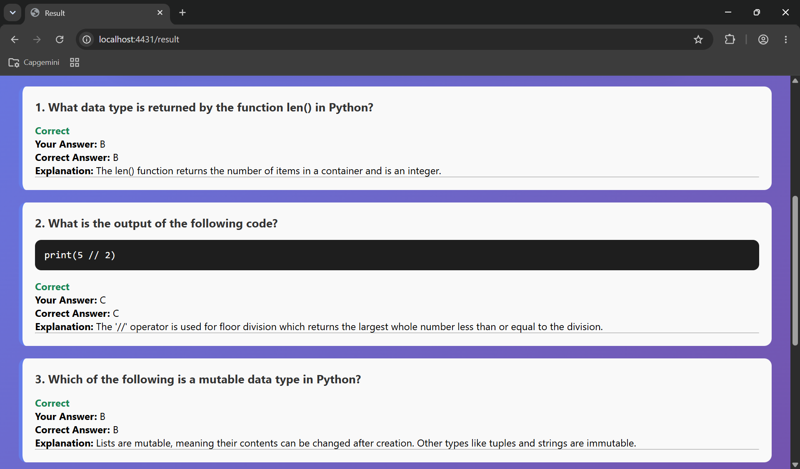

# EDUQUIZ

An AI-powered educational quiz application built using **Flask** and **OpenAI-compatible Generative AI services**. The application dynamically generates multiple-choice questions (MCQs) based on a user-selected topic, difficulty level, and number of questions.

Users can take the quiz, receive instant scoring, review their answers, and learn from detailed explanations generated by AI.

---

# Features

✅ Generate quizzes dynamically using Generative AI

✅ Select any topic for quiz generation

✅ Multiple difficulty levels (Easy, Medium, Hard)

✅ Configurable number of questions

✅ Support for programming-related questions

✅ Automatic answer evaluation

✅ Explanation for every question

✅ Session-based progress tracking

✅ Detailed review page after quiz completion

✅ Score and percentage calculation

---

# Technology Stack

## Backend

- Python
- Flask

## AI Integration

- OpenAI Python SDK
- OpenAI-Compatible Generative AI Endpoint

## Frontend

- HTML
- CSS
- Jinja2 Templates

## Configuration

- Python Dotenv

## Session Management

- Flask Session

---

# Project Architecture

```text
+----------------+
|     User       |
+----------------+
        |
        v
+----------------+
|   index.html   |
+----------------+
        |
        v
+----------------+
| Flask Backend  |
+----------------+
        |
        v
+----------------------+
| Generative AI Model  |
+----------------------+
        |
        v
+----------------------+
| Quiz JSON Response   |
+----------------------+
        |
        v
+----------------------+
| Flask Session Store  |
+----------------------+
        |
        v
+----------------+
|   quiz.html    |
+----------------+
        |
        v
+----------------+
|  result.html   |
+----------------+
```

---

# Application Workflow

## Step 1: Create Quiz

The user enters:

- Topic
- Difficulty Level
- Number of Questions

Example:

```text
Topic: Python
Difficulty: Easy
Questions: 5
```

---

## Step 2: Prompt Generation

The Flask application dynamically creates:

### System Prompt

Defines:

- JSON output format
- MCQ structure
- Programming question rules
- Explanation generation rules

### User Prompt

Contains:

```text
Topic: Python
Difficulty: Easy
Generate exactly 5 MCQs
```

---

## Step 3: Quiz Generation

The application sends prompts to the configured Generative AI model.

Example API call:

```python
response = client.chat.completions.create(
    model=os.getenv("GENAI_MODEL"),
    messages=[
        {"role": "system", "content": system_prompt},
        {"role": "user", "content": user_prompt}
    ]
)
```

The model returns quiz questions in JSON format.

Example:

```json
[
  {
    "question": "What is Python?",
    "code": "",
    "options": {
      "A": "Programming Language",
      "B": "Database",
      "C": "Operating System",
      "D": "Compiler"
    },
    "answer": "A",
    "explanation": "Python is a high-level programming language."
  }
]
```

---

## Step 4: Store Quiz in Session

Generated quiz data is stored in Flask Session.

```python
session["questions"]
session["current_question"]
session["score"]
session["review"]
```

---

## Step 5: Quiz Attempt

The user answers each question.

For every submission:

1. Selected answer is captured.
2. Correct answer is validated.
3. Score is updated.
4. Review information is stored.

---

## Step 6: Result Evaluation

Score percentage is calculated:

```python
percentage = (score / total) * 100
```

Performance messages:

| Percentage | Message |
|------------|----------|
| 80% or above | Excellent! |
| 60% to 79% | Good Job! |
| Below 60% | Keep Practicing! |

---

## Step 7: Review Answers

Users can view:

- Question
- Code snippet (if applicable)
- Selected answer
- Correct answer
- Explanation
- Result status

---

# Folder Structure

```text
AI-Quiz-Generator/
│
├── app.py
├── .env
├── requirements.txt
│
├── templates/
│   ├── index.html
│   ├── quiz.html
│   └── result.html
│
├── static/
│   ├── css/
│   └── images/
│
└── README.md
```

---

## Configure Environment Variables

Create a `.env` file in the root directory.

```env
GENAI_API_KEY=your_api_key
GENAI_BASE_URL=your_genai_endpoint
GENAI_MODEL=your_model_name
```

### Environment Variables

| Variable | Description |
|-----------|-------------|
| GENAI_API_KEY | API Key used to authenticate requests |
| GENAI_BASE_URL | Base URL of the AI endpoint |
| GENAI_MODEL | Model name used for quiz generation |

---

## Run Application

```bash
python app.py
```

Application URL:

```text
http://localhost:4431
```

---

# Session Management

The application uses Flask sessions to maintain quiz state.

Stored values:

```python
session["questions"]
session["current_question"]
session["score"]
session["review"]
```

Purpose:

- Maintain quiz progress
- Track user score
- Store answer review data
- Avoid database dependency

---

# Quiz JSON Structure

Each generated question follows the structure below:

```json
{
  "question": "Question text",
  "code": "",
  "options": {
    "A": "Option A",
    "B": "Option B",
    "C": "Option C",
    "D": "Option D"
  },
  "answer": "A",
  "explanation": "Explanation text"
}
```

---

# Programming Question Support

Programming questions are handled separately.

Example:

```json
{
  "question": "What is the output of the following code?",
  "code": "print(type(3.14))",
  "options": {
    "A": "<class 'int'>",
    "B": "<class 'float'>",
    "C": "<class 'str'>",
    "D": "Error"
  },
  "answer": "B",
  "explanation": "3.14 is a floating-point value in Python."
}
```

Benefits:

- Clean question text
- Proper code rendering
- Better readability

---

# Error Handling Recommendations

## Invalid JSON Response

Wrap parsing in a try-except block:

```python
try:
    questions = json.loads(quiz_content)
except json.JSONDecodeError:
    return "Invalid quiz format received from AI"
```

---

## Missing Environment Variables

Verify:

```text
GENAI_API_KEY
GENAI_BASE_URL
GENAI_MODEL
```

are configured correctly.

---


# Screenshots

## Home Page

The landing page where users can select a topic, difficulty level, and the number of questions to generate.



---

## Quiz Page

Displays AI-generated multiple-choice questions. Users can select an answer and navigate through the quiz.



---

## Results Page

Shows the final score, percentage achieved, performance message, and answer review.



---

## Answer Review & Explanation

Provides a detailed review of each question, including the user's answer, correct )answer, and AI-generated explanation.


---

# Author

**Havish Gadey**

Analyst @ Capgemini

